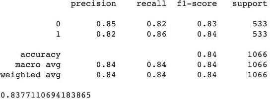
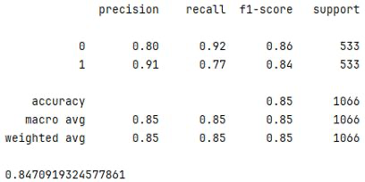

# Fine-tuning Bert-base-cased using rotten-tomatoes dataset and embeddings MixUp augmentation method

> [!IMPORTANT]
> Fine-tuned модель на расширенном датасете методом аугментации MixUp доступна по ссылке: https://drive.google.com/drive/u/0/folders/1eTPr3ZxCFUjIc3_W7g8K_C6xfWh-AmPR
>
> Скаченные файлы из google drive необходимо поместить в папку bert-base-cased-rotten-tomatoes-mixup в корне проекта

## Краткое описание проекта
Fine-tuning модели Bert-base-cased на датасете rotten-tomatoes

Rotten-tomatoes - набор данных обзоров фильмов. Каждый отзыв характеризуется меткой 1 (положительный отзыв) и 0 (негативный отзыв) Набор данных состоит из 5331 положительных отзывов и 5331 негативных
* Обучающая часть состоит из 8530 отзывов
* Валидационная часть состоит из 1066 отзывов
* Тестовая часть состоит из 1066 отзывов

Для этапа fine-tuning была использована модель bert-base-cased. Embeddings MixUp метод увеличил размер обучающего датасета до 12031. Для получения дополнительных 3500 объектов были задействованы 7000 случайных экземпляров из датасета для получения их комбинаций.

Embeddings MixUp метод - один из методов аугментации данных для классификации текста и изображений.
Важным шагом для классификации текста является  преобразование текста в векторное представление, для этого используются transformer-based pre-trained output features. Формула аугментации MixUp на уровне эмбеддингов:

xˆ = λ * T (xi ) + (1 − λ) * T (xj ),  где T (xi ), T (xj )- векторные представления слов, полученные на выходе модели

yˆ= λ * yi + (1-λ) * yj, где yi, yj - метки

xˆ, yˆ - новый экземпляр

i,j - индексы случайно выбранных объектов из тренеровочного датасета 

## Структура проекта
Проект состоит из 3 основных этапов:
### Этап подготовки
Этап подготовки обучающей, валидационной частей. Она включает в себя токенизацию текста и процесс аугментации (для обучающей выборки).
#### data_preparation.py 
Загружает датасет rotten-tomatoes из модуля datasets.
Токенезирует все текстовые записи из тренировочной, валидационной частей.
Запускает процесс аугментации данных embeddings MixUp методом для создания новых 3500 размеченных отзывов.
### Тренировочный этап
Модель bert-base-cased обучается на 12031 размеченных отзывах. Метрика - accuracy score.
Параметры обучения: 3 эпохи, размер batch для каждого устройства 8, learning rate 1e-5.
#### train.py
Запускает data_preparation.py и загружает тренировочный и валидационный датасеты, загружает pre-trained  bert-base-cased, формирует тренировочные параметры и запускает fine-tuning процесс.
### Этап тестирования
Дообученная модель (при отсутствии тренировочного этапа есть возможность загрузить модель из облака) тестируется на тестовой части датасета. Для оценки качества модели используется метрика accuracy score.
#### test.py
Загружает датасет rotten-tomatoes из модуля datasets и готовит тестовую выборку для оценки качества дообученной модели. Если был пропущен этап дообучения train.py , модель, дообученная на расширенном тренировочном датасете, полученного embeddings MixUp методом аугментации данных загружается из облака

Этап тестирования может выполняться независимо от тренировочного этапа при наличии дообученой модели в папке bert-base-cased-rotten-tomatoes-mixup. Для этого в проекте реализован метод для загрузки модели из google drive (см. https://drive.google.com/drive/u/0/folders/1eTPr3ZxCFUjIc3_W7g8K_C6xfWh-AmPR) 
## Результаты
Аналитика показывает, что дообученная модель bert-base-cased на датасете без использования аугментации embeddings MixUp методом по метрике accuracy-score позволяет получить следующие результаты:

Accuracy (точность): 0.83

Fine-tuning модели с использованием метода аугментации MixUp на уровне эмбеддингов позволяет получить следующие результаты: 

Accuracy (точность): 0.84

Таким образом, использование embeddings MixUp метода для увеличения тренировочного датасета на 3500 размеченных текстов позволяет увеличить точность c 0.837 до 0.847.

## Инструкция к запуску
Для запуска проекта был подготовлен Makefile, в котором реализованы 4 команды: 
* build - создает/обновляет docker образ
* train - запуск процесса обучения модели
* test - запуск процесса тестирования модели
* fullrun - полное выполнение всех этапов (обучение модели и тестирование)

Для запуска любой из них необходимо выполнить команду ``make <название команды>``

